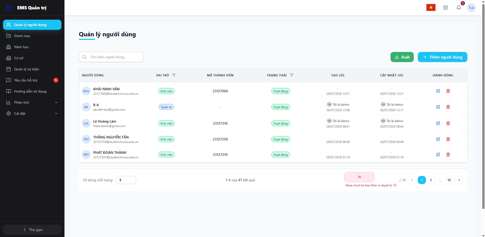
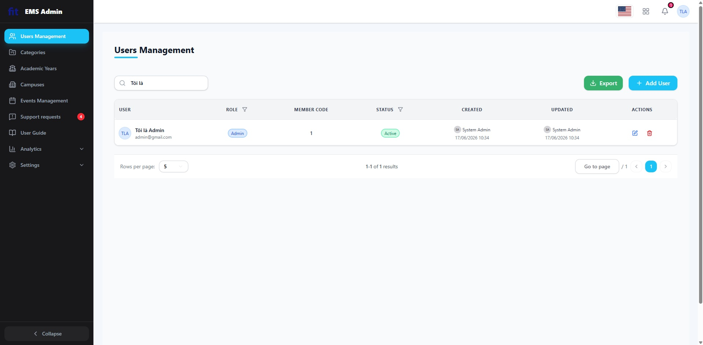
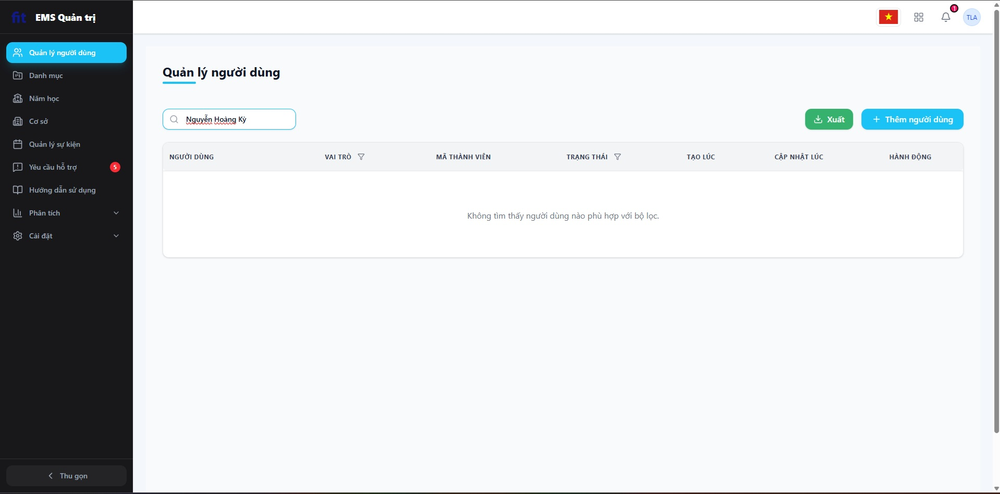
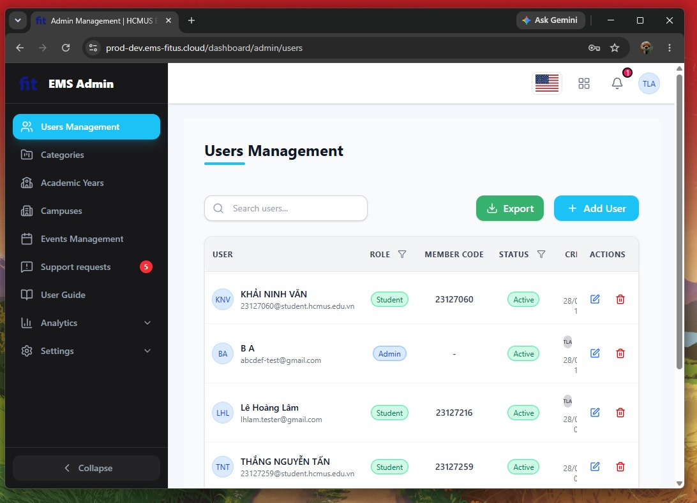
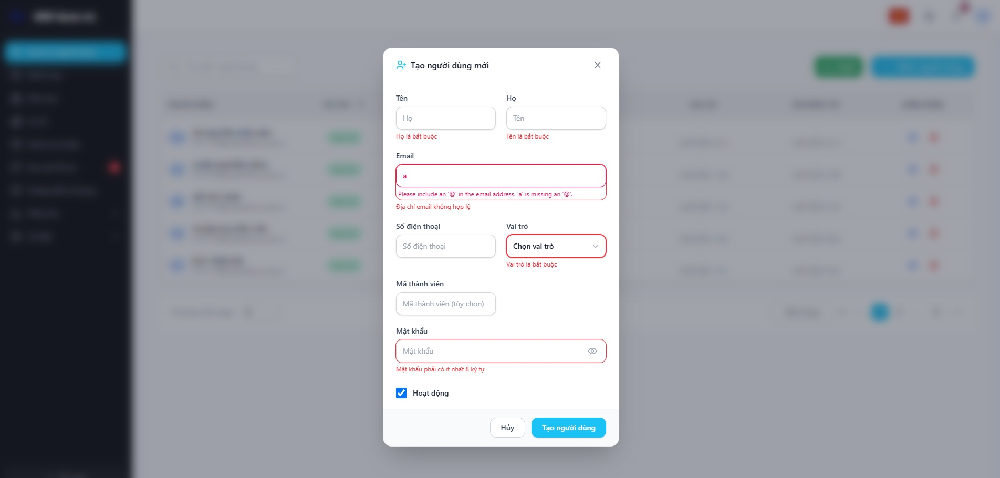
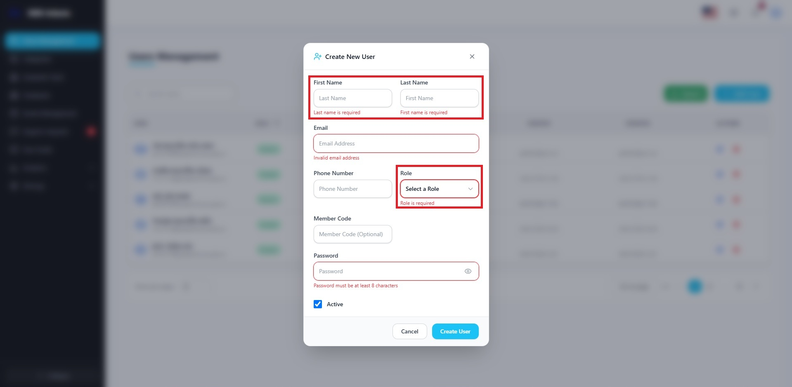
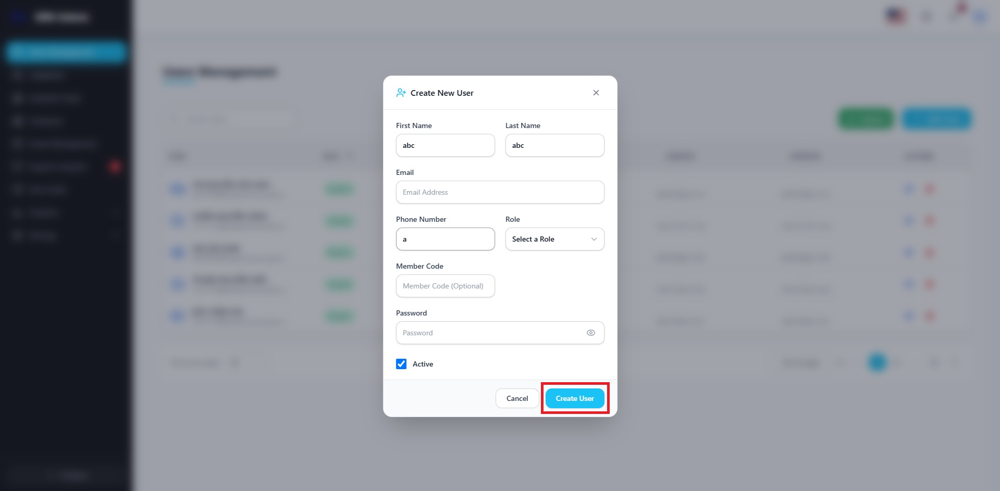
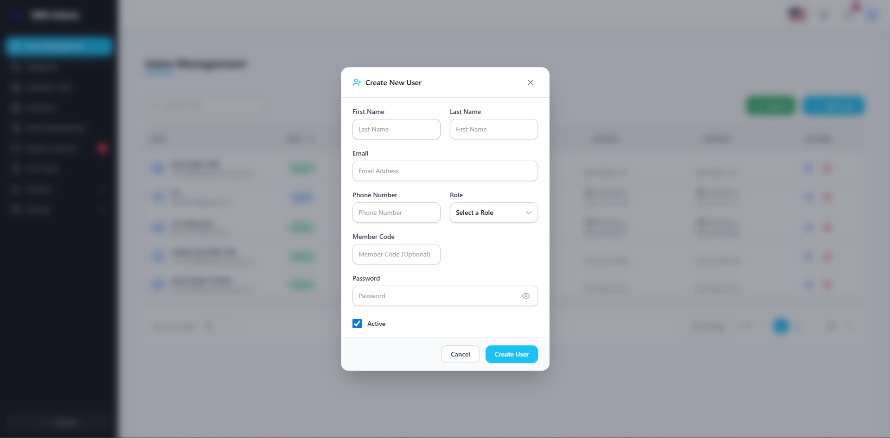
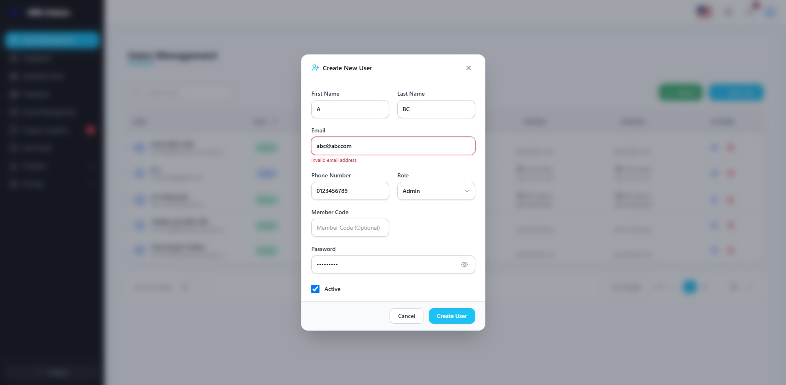

# Bug & Usability Findings Log

Kịch bản: **Scenario C — Admin Manages Users**  
Họ và tên: **Dương Gia Huy**
MSSV: **23127052**

---

Bảng dưới đây tổng hợp tất cả các lỗi chức năng (Bugs) và các vấn đề về trải nghiệm người dùng (Usability) được tìm thấy trong quá trình thực hiện checklist và kiểm thử tự do trên hệ thống EMS.

| ID | Scenario/Screen | Type (Bug / Usability) | Description | Steps/Heuristic | Severity | Suggested fix | Screenshot ref |
|---|---|---|---|---|---|---|---|
| BUG-C1-01 | C1 - Users List | Bug | Lỗi ngôn ngữ hiển thị thông báo validation tại ô phân trang 'Đến trang'. Khi nhập giá trị không hợp lệ (ví dụ: > 10 hoặc < 1), thông báo lỗi hiển thị bằng tiếng Anh mặc dù giao diện đang dùng tiếng Việt. | **IA-01-04** / Đổi giao diện sang tiếng Việt -> Nhập 11 (nếu có 10 trang) hoặc nhập -1 vào ô 'Đến trang' -> Nhấn Enter -> Xem thông báo. | 1 (Low) | Sử dụng custom validation message bằng tiếng Việt hoặc đồng bộ thông điệp validation mặc định của HTML5 với ngôn ngữ hiển thị. |   |
| BUG-C1-02 | C1 - Users List | Bug | Danh sách người dùng không tự động đồng bộ theo thời gian thực (Real-time update) giữa các phiên làm việc của Admin. | **IA-04-09** / Mở 2 tab Admin song song -> Tab 1 thay đổi tên user từ "def abc" thành "B A" -> Tab 2 vẫn giữ nguyên tên cũ "def abc" cho đến khi tải lại trang. | 2 (Medium) | Sử dụng WebSocket hoặc cơ chế polling/revalidation để tự động cập nhật UI khi database có thay đổi. |   |
| BUG-C1-03 | C1 - Users List | Bug | Chức năng tìm kiếm (Search users) bị lỗi phản hồi chậm/mất đồng bộ (debounce/race condition) khi người dùng gõ quá nhanh. | **Functional Bug 1** / Nhập từ khóa tìm kiếm (ví dụ "Tôi là Admin") với tốc độ gõ phím rất nhanh -> Kết quả hiển thị rỗng, nhưng gõ chậm/từng ký tự thì hiển thị đúng. | 3 (High) | Tối ưu hóa hàm debounce khi gõ phím và xử lý triệt để race condition của API call để kết quả trả về đúng theo kí tự cuối cùng được nhập. |   |
| BUG-C1-04 | C1 - Users List | Bug | Chức năng tìm kiếm không hoạt động chính xác khi gõ đầy đủ họ và tên của user (ví dụ gõ "Nguyễn Hoàng Kỳ" thì không ra kết quả, nhưng gõ "Nguyễn Hoàng" thì ra). | **Functional Bug 2** / Nhập tên đầy đủ của một user tồn tại trong hệ thống (ví dụ: "Nguyễn Hoàng Kỳ") vào ô tìm kiếm -> Kết quả hiển thị rỗng. | 3 (High) | Cấu hình lại thuật toán đối sánh từ khóa tìm kiếm (search query) phía backend để hỗ trợ tìm kiếm khớp chính xác chuỗi có dấu dài và nhiều khoảng trắng. |   |
| BUG-C1-05 | C1 - Users List | Usability | Sidebar không tự động co giãn/thu gọn khi thu nhỏ màn hình trình duyệt, làm che khuất các cột của bảng danh sách người dùng. | **IA-01-07** / Thu nhỏ chiều rộng trình duyệt dần dần -> Quan sát sidebar và bảng danh sách. | 2 (Medium) | Thiết lập truy vấn media query trong CSS để tự động ẩn/thu gọn sidebar thành dạng icon thu nhỏ (collapsed style) khi độ rộng màn hình dưới mức breakpoint (ví dụ 1024px). |  |
| BUG-C2-01 | C2 - Create User Form | Bug | Đa ngôn ngữ (i18n) hiển thị không nhất quán. Khi xảy ra lỗi validation email, thông báo trả về hiển thị tiếng Anh trong khi giao diện đang để tiếng Việt. | **IA-01-04** / Nhập email sai định dạng (ví dụ: "a") -> Nhấn "Create User" -> Xem lỗi thông báo. | 2 (Medium) | Cấu hình validation để trả về thông báo tương ứng với ngôn ngữ đã chọn (EN/VI). |  |
| BUG-C2-02 | C2 - Create User Form | Usability | Các trường thông tin bắt buộc không có ký hiệu đánh dấu trực quan (như dấu `*`). | **IA-02-01** / Truy cập form tạo người dùng -> Để trống các trường -> Bấm "Create User". | 2 (Medium) | Thêm ký hiệu hoa thị màu đỏ `*` bên cạnh tên các nhãn (Labels) bắt buộc nhập. |  |
| BUG-C2-03 | C2 - Create User Form | Usability | Không có validation thời gian thực cho định dạng email. Lỗi chỉ hiển thị sau khi submit. | **IA-02-03** / Nhập email không hợp lệ (ví dụ: "a") và quan sát (không có phản hồi tức thời). | 1 (Low) | Thêm tính năng validation on-the-fly (blur/keyup event) để cảnh báo lỗi ngay khi nhập. |  |
| BUG-C2-04 | C2 - Create User Form | Usability | Nút Submit "Create User" không bị vô hiệu hóa khi form chứa dữ liệu lỗi hoặc trống. | **IA-02-08** / Để trống email hoặc nhập phone number là "a" -> Nút bấm vẫn active. | 1 (Low) | Disable nút "Create User" và chỉ active khi toàn bộ các trường bắt buộc đã được điền hợp lệ. |  |
| BUG-C2-05 | C2 - Create User Form | Usability | Không hiển thị Toast thông báo sau khi tạo người dùng thành công. | **IA-04-01** / Điền đầy đủ thông tin hợp lệ -> Bấm "Create User" -> Tài khoản được tạo nhưng không có toast báo thành công. | 2 (Medium) | Tích hợp hệ thống Toast notification để hiển thị thông báo "Tạo người dùng thành công!" sau khi hoàn thành. |   |
| BUG-C2-06 | C2 - Create User Form | Usability | Cảnh báo lỗi tối nghĩa và thô sơ khi bị mất kết nối mạng đột ngột lúc tạo user. | **IA-04-10** / Ngắt kết nối mạng -> Bấm "Create User" -> Nhận lỗi "Failed to fetch". | 2 (Medium) | Bắt lỗi network error và hiển thị thông báo thân thiện hơn như "Không thể kết nối tới máy chủ. Vui lòng kiểm tra lại đường truyền." |  |
| BUG-C2-07 | C2 - Create User Form | Usability | Kích thước form Create User bị thu nhỏ quá mức (zoom out) trên màn hình mobile, khiến giao diện cực kỳ bé và rất khó thao tác. | **IA-01-07** / Sử dụng chế độ Responsive của trình duyệt (hoặc điện thoại thật) mở form Create User -> Quan sát tỷ lệ hiển thị. | 2 (Medium) | Sử dụng thiết kế responsive (fluid layout, flexbox/grid) và điều chỉnh viewport/CSS để form hiển thị vừa vặn, cỡ chữ tối thiểu đạt 14px-16px trên thiết bị di động. |  |
| BUG-C2-08 | C2 - Create User Form | Usability | Trường First Name và Last Name bị hoán đổi placeholder gợi ý cho nhau. | **IA-02-02** / Mở form Create User -> Quan sát placeholder hiển thị trong ô First Name và Last Name. | 1 (Low) | Đổi lại placeholder gợi ý của ô nhập First Name thành "First name" (hoặc "Tên") và Last Name thành "Last name" (hoặc "Họ") cho chính xác. |  |
| BUG-C2-09 | C2 - Create User Form | Usability | Thông báo lỗi không rõ ràng, chung chung khi nhập email thiếu đuôi tên miền (như "abc@abccom"). | **IA-02-04** / Nhập email "abc@abccom" -> Bấm Create User -> Quan sát thông điệp thông báo lỗi hiển thị. | 1 (Low) | Cải thiện chi tiết nội dung thông điệp báo lỗi thành: "Định dạng email không hợp lệ (thiếu tên miền, ví dụ: .com, .vn)" để người dùng dễ tự khắc phục. |  |
