# Bug & Usability Findings Log

Kịch bản: **Scenario C — Admin Manages Users**  
Họ và tên: **Dương Gia Huy**
MSSV: **23127052**

---

Bảng dưới đây tổng hợp tất cả các lỗi chức năng (Bugs) và các vấn đề về trải nghiệm người dùng (Usability) được tìm thấy trong quá trình thực hiện checklist và kiểm thử tự do trên hệ thống EMS.

| ID | Scenario/Screen | Type (Bug / Usability) | Description | Steps/Heuristic | Severity | Suggested fix | Screenshot ref |
|---|---|---|---|---|---|---|---|
| BUG-C1-01 | C1 - Users List | Bug | Lỗi ngôn ngữ hiển thị thông báo validation tại ô phân trang 'Đến trang'. Khi nhập giá trị không hợp lệ (ví dụ: > 10 hoặc < 1), thông báo lỗi hiển thị bằng tiếng Anh mặc dù giao diện đang dùng tiếng Việt. | **IA-01-04** 1. Đổi giao diện sang tiếng Việt 2. Nhập 11 (nếu có 10 trang) hoặc nhập -1 vào ô 'Đến trang' 3. Nhấn Enter 4. Xem thông báo. | 1 (Low) | Sử dụng custom validation message bằng tiếng Việt hoặc đồng bộ thông điệp validation mặc định của HTML5 với ngôn ngữ hiển thị. |   |
| BUG-C1-02 | C1 - Users List | Bug | Danh sách người dùng không tự động đồng bộ theo thời gian thực (Real-time update) giữa các phiên làm việc của Admin. | **IA-04-09** 1. Mở 2 tab Admin song song 2. Tab 1 thay đổi tên user từ "def abc" thành "B A" 3. Tab 2 vẫn giữ nguyên tên cũ "def abc" cho đến khi tải lại trang. | 2 (Medium) | Sử dụng WebSocket hoặc cơ chế polling/revalidation để tự động cập nhật UI khi database có thay đổi. | 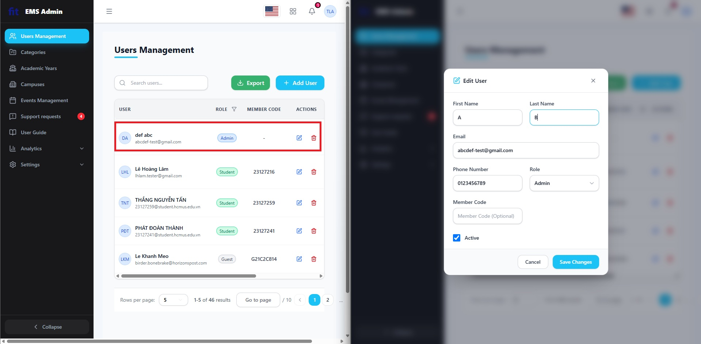 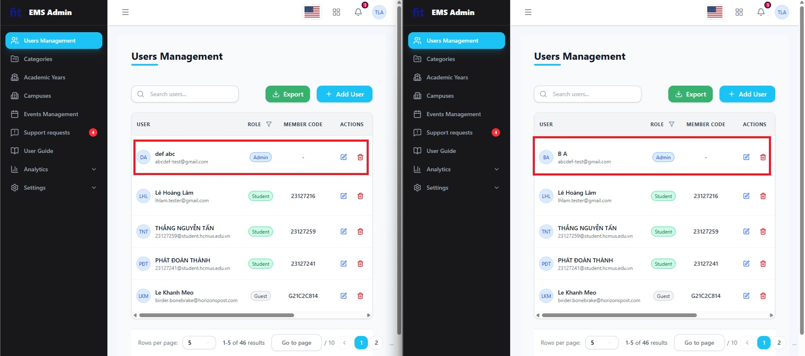 |
| BUG-C1-03 | C1 - Users List | Bug | Chức năng tìm kiếm (Search users) bị lỗi phản hồi chậm/mất đồng bộ (debounce/race condition) khi người dùng gõ quá nhanh. | **Functional Bug 1** 1. Nhập từ khóa tìm kiếm (ví dụ "Tôi là" để tìm kiếm user "Tôi là Admin") với tốc độ gõ phím rất nhanh 2. Kết quả hiển thị rỗng, nhưng gõ chậm/từng ký tự thì hiển thị đúng. | 3 (High) | Tối ưu hóa hàm debounce khi gõ phím và xử lý triệt để race condition của API call để kết quả trả về đúng theo kí tự cuối cùng được nhập. | 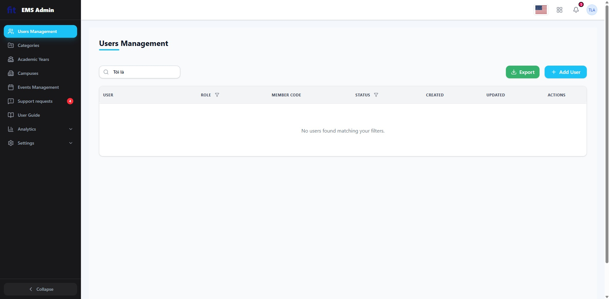  |
| BUG-C1-04 | C1 - Users List | Bug | Chức năng tìm kiếm không hoạt động chính xác khi gõ đầy đủ họ và tên của user (ví dụ gõ "Nguyễn Hoàng Kỳ" thì không ra kết quả, nhưng gõ "Nguyễn Hoàng" thì ra). | **Functional Bug 2** 1. Nhập tên đầy đủ của một user tồn tại trong hệ thống (ví dụ: "Nguyễn Hoàng Kỳ") vào ô tìm kiếm 2. Kết quả hiển thị rỗng. | 3 (High) | Cấu hình lại thuật toán đối sánh từ khóa tìm kiếm (search query) phía backend để hỗ trợ tìm kiếm khớp chính xác chuỗi có dấu dài và nhiều khoảng trắng. | 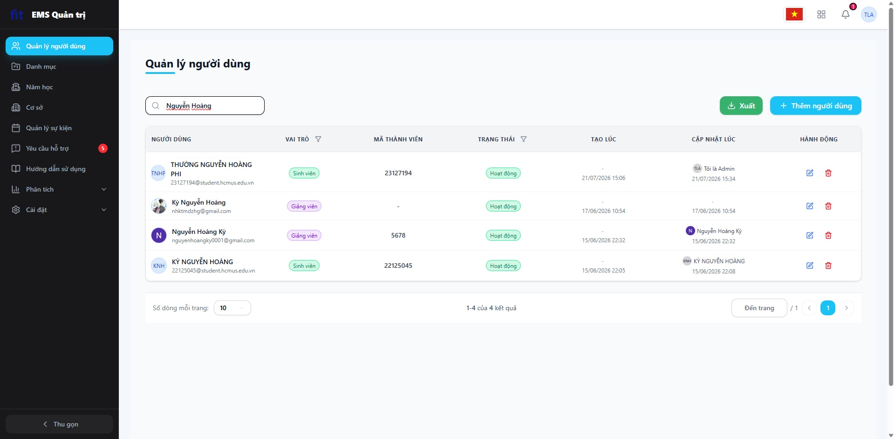  |
| BUG-C1-05 | C1 - Users List | Usability | Sidebar không tự động co giãn/thu gọn khi thu nhỏ màn hình trình duyệt, làm che khuất các cột của bảng danh sách người dùng. | **IA-01-07** 1. Thu nhỏ chiều rộng trình duyệt dần dần 2. Quan sát sidebar và bảng danh sách. | 2 (Medium) | Thiết lập truy vấn media query trong CSS để tự động ẩn/thu gọn sidebar thành dạng icon thu nhỏ (collapsed style) khi độ rộng màn hình dưới mức breakpoint (ví dụ 1024px). |  |
| BUG-C1-06 | C1 - Users List | Bug | Chức năng tìm kiếm kết hợp phân trang (pagination) bị lỗi hiển thị dữ liệu sai lệch khi nhập từ khóa chữ thường ("hoàng", "kỳ"). | **Task 2 - Usability** 1. Nhập từ khóa chữ viết thường. 2. Bấm Enter/Search. 3. Danh sách hiển thị bị sai lệch, phải bấm chuyển trang ở pagination dưới cùng mới hiển thị đúng. | 3 (High) | Khắc phục lỗi đồng bộ state của Pagination khi gọi API filter tìm kiếm. Đảm bảo tìm kiếm không phân biệt hoa/thường. | 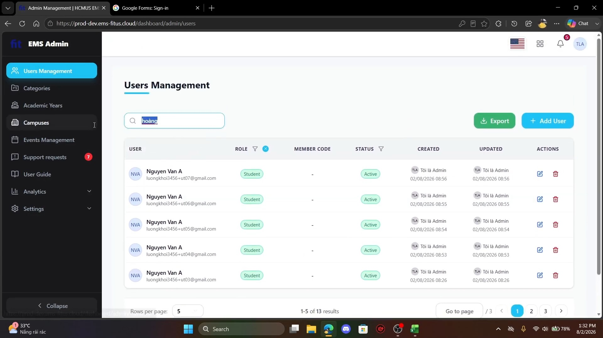 |
| BUG-C1-07 | C1 - Users List | Usability | Giao diện danh sách người dùng thiếu tính năng xem thông tin chi tiết (User Detail), khiến người quản trị không thể xem tổng quan thông tin của 1 user. | **Task 2 - Usability** 1. Truy cập danh sách người dùng. 2. Cố gắng click vào hàng dữ liệu hoặc tìm icon View Detail. | 2 (Medium) | Bổ sung hành động View (icon con mắt) ở cột Action hoặc cho phép click thẳng vào hàng để mở trang chi tiết. | 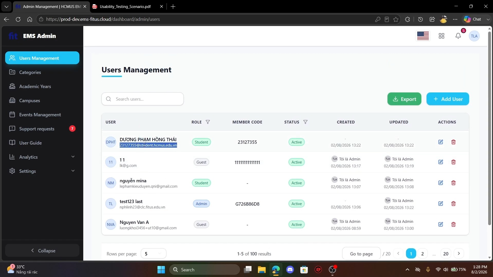 |
| BUG-C1-08 | C1 - Users List | Usability | Khu vực bộ lọc Role/Status quá nhỏ, thiếu trực quan và thiếu nút Clear Filter nhanh khiến người dùng lúng túng khi muốn hủy bộ lọc. | **Task 2 - Usability** 1. Tìm kiếm và áp dụng bộ lọc. 2. Tìm cách hủy bộ lọc nhanh chóng trên giao diện. | 2 (Medium) | Làm nổi bật khu vực bộ lọc trên giao diện và thêm nút "Hủy bộ lọc" (Clear Filter) nhanh bên cạnh. | 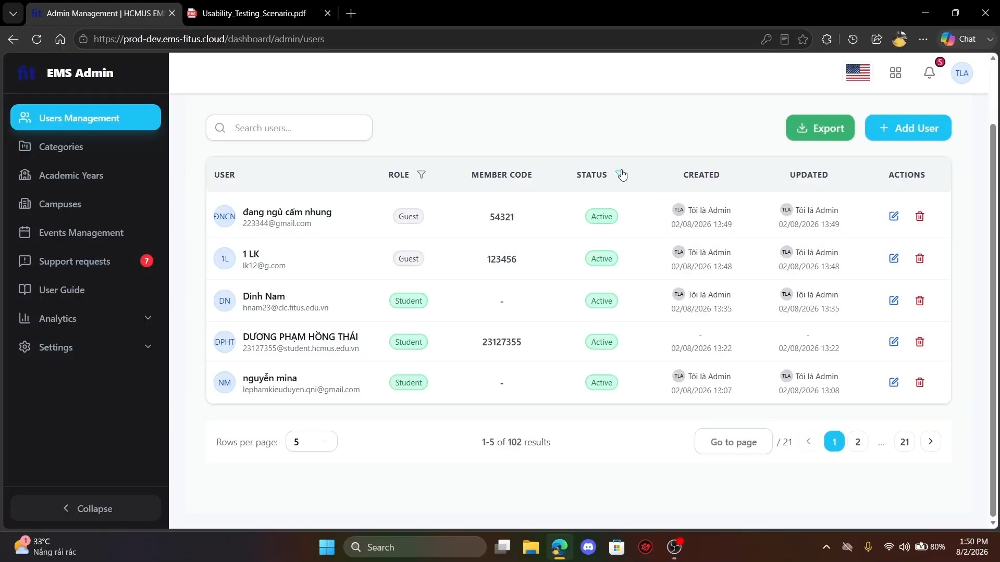 |
| BUG-C2-01 | C2 - Create User Form | Bug | Đa ngôn ngữ (i18n) hiển thị không nhất quán. Khi xảy ra lỗi validation email, thông báo trả về hiển thị tiếng Anh trong khi giao diện đang để tiếng Việt. | **IA-01-04** 1. Nhập email sai định dạng (ví dụ: "a") 2. Nhấn "Create User" 3. Xem lỗi thông báo. | 2 (Medium) | Cấu hình validation để trả về thông báo tương ứng với ngôn ngữ đã chọn (EN/VI). |  |
| BUG-C2-02 | C2 - Create User Form | Usability | Các trường thông tin bắt buộc không có ký hiệu đánh dấu trực quan (như dấu `*`). | **IA-02-01** 1. Truy cập form tạo người dùng 2. Để trống các trường 3. Bấm "Create User". | 2 (Medium) | Thêm ký hiệu hoa thị màu đỏ `*` bên cạnh tên các nhãn (Labels) bắt buộc nhập. |  |
| BUG-C2-03 | C2 - Create User Form | Usability | Không có validation thời gian thực cho định dạng email. Lỗi chỉ hiển thị sau khi submit. | **IA-02-03** 1. Nhập email không hợp lệ (ví dụ: "a") 2. Quan sát (không có phản hồi tức thời). | 1 (Low) | Thêm tính năng validation on-the-fly (blur/keyup event) để cảnh báo lỗi ngay khi nhập. | 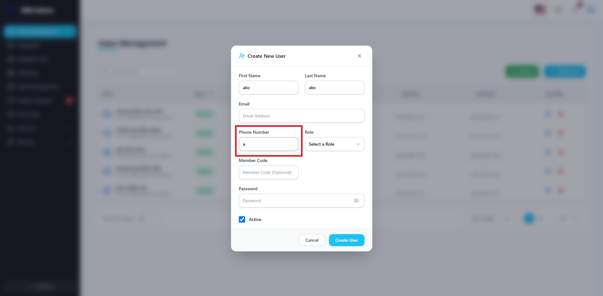 |
| BUG-C2-04 | C2 - Create User Form | Usability | Nút Submit "Create User" không bị vô hiệu hóa khi form chứa dữ liệu lỗi hoặc trống. | **IA-02-08** 1. Để trống email hoặc nhập phone number là "a" 2. Nút bấm vẫn active. | 1 (Low) | Disable nút "Create User" và chỉ active khi toàn bộ các trường bắt buộc đã được điền hợp lệ. |  |
| BUG-C2-05 | C2 - Create User Form | Usability | Không hiển thị Toast thông báo sau khi tạo người dùng thành công. | **IA-04-01** 1. Điền đầy đủ thông tin hợp lệ 2. Bấm "Create User" 3. Tài khoản được tạo nhưng không có toast báo thành công. | 2 (Medium) | Tích hợp hệ thống Toast notification để hiển thị thông báo "Tạo người dùng thành công!" sau khi hoàn thành. | 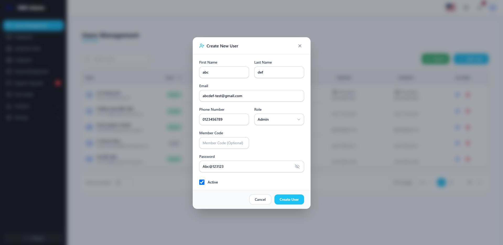 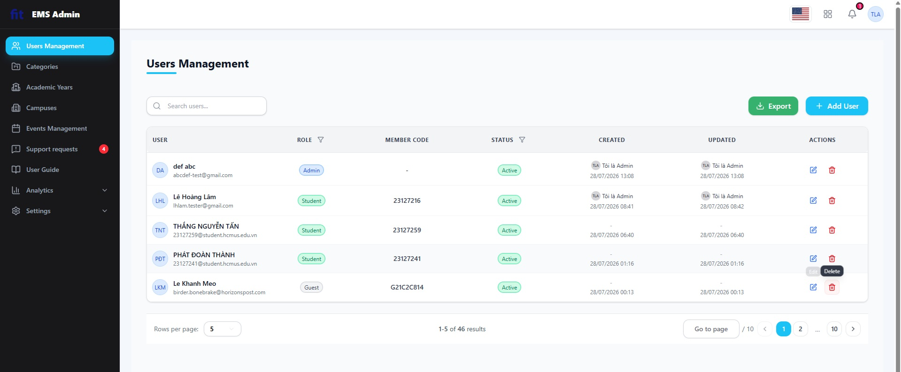 |
| BUG-C2-06 | C2 - Create User Form | Usability | Cảnh báo lỗi tối nghĩa và thô sơ khi bị mất kết nối mạng đột ngột lúc tạo user. | **IA-04-10** 1. Ngắt kết nối mạng 2. Bấm "Create User" 3. Nhận lỗi "Failed to fetch". | 2 (Medium) | Bắt lỗi network error và hiển thị thông báo thân thiện hơn như "Không thể kết nối tới máy chủ. Vui lòng kiểm tra lại đường truyền." | 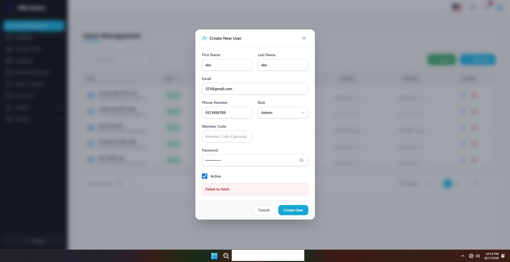 |
| BUG-C2-07 | C2 - Create User Form | Usability | Kích thước form Create User bị thu nhỏ quá mức (zoom out) trên màn hình mobile, khiến giao diện cực kỳ bé và rất khó thao tác. | **IA-01-07** 1. Sử dụng chế độ Responsive của trình duyệt (hoặc điện thoại thật) mở form Create User 2. Quan sát tỷ lệ hiển thị. | 2 (Medium) | Sử dụng thiết kế responsive (fluid layout, flexbox/grid) và điều chỉnh viewport/CSS để form hiển thị vừa vặn, cỡ chữ tối thiểu đạt 14px-16px trên thiết bị di động. | 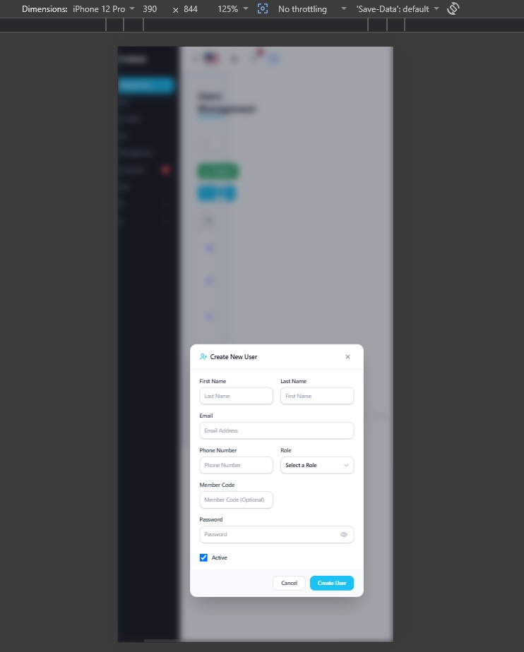 |
| BUG-C2-08 | C2 - Create User Form | Usability | Trường First Name và Last Name bị hoán đổi placeholder gợi ý cho nhau. | **IA-02-02** 1. Mở form Create User 2. Quan sát placeholder hiển thị trong ô First Name và Last Name. | 1 (Low) | Đổi lại placeholder gợi ý của ô nhập First Name thành "First name" (hoặc "Tên") và Last Name thành "Last name" (hoặc "Họ") cho chính xác. | 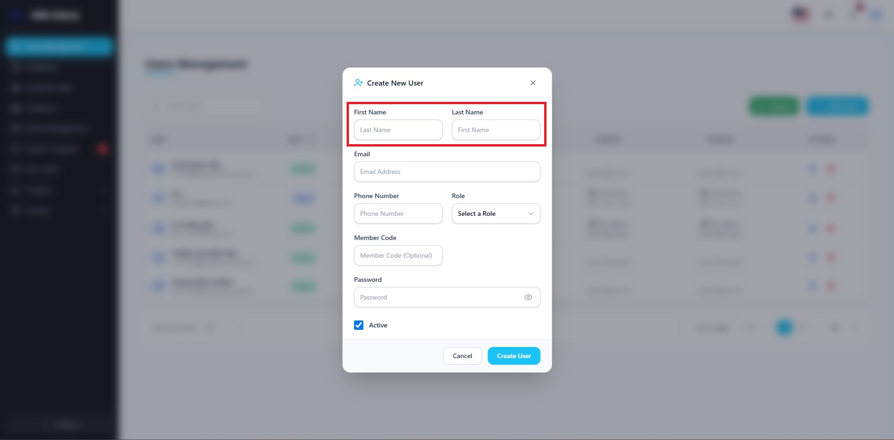 |
| BUG-C2-09 | C2 - Create User Form | Usability | Thông báo lỗi không rõ ràng, chung chung khi nhập email thiếu đuôi tên miền (như "abc@abccom"). | **IA-02-04** 1. Nhập email "abc@abccom" 2. Bấm Create User 3. Quan sát thông điệp thông báo lỗi hiển thị. | 1 (Low) | Cải thiện chi tiết nội dung thông điệp báo lỗi thành: "Định dạng email không hợp lệ (thiếu tên miền, ví dụ: .com, .vn)" để người dùng dễ tự khắc phục. | 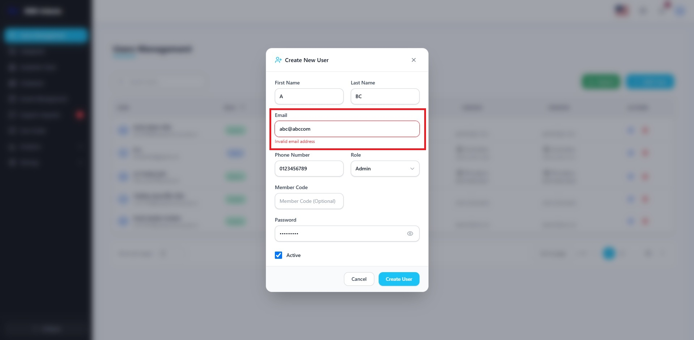 |
| BUG-C2-10 | C2 - Create User Form | Usability | Validation của Form báo lỗi tuần tự từng trường một (sửa xong trường này bấm nút mới báo lỗi trường kia), gây ức chế và mất thời gian. | **Task 2 - Usability** 1. Bỏ trống hoặc nhập sai nhiều trường bắt buộc. 2. Nhấn Create User nhiều lần để xem từng lỗi xuất hiện. | 2 (Medium) | Validate toàn bộ form và hiển thị đồng loạt tất cả các trường bị lỗi trong một lần nhấn nút. | 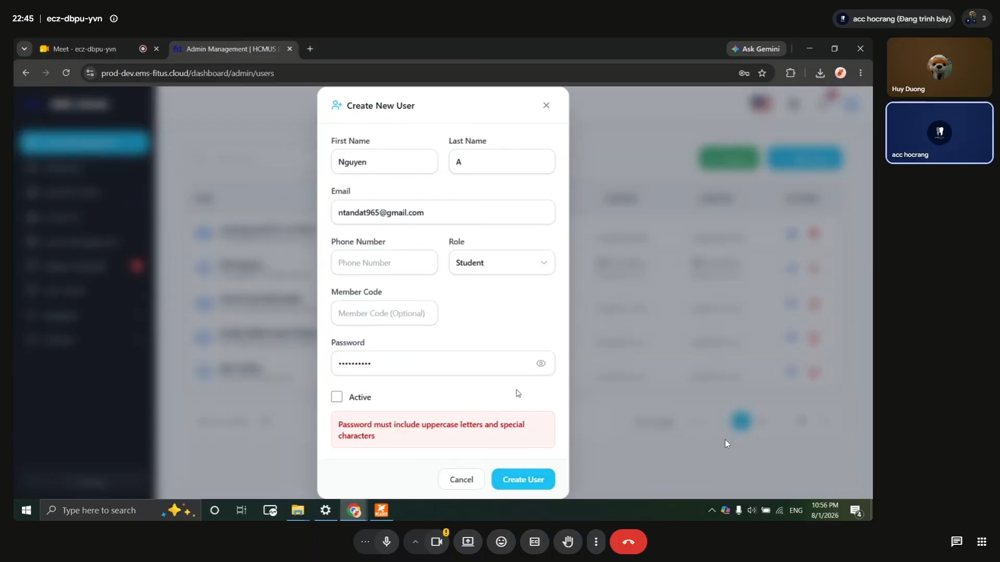 |
| BUG-C2-11 | C2 - Create User Form | Usability | Con trỏ chuột không đổi thành dạng pointer (hình bàn tay) khi di chuột lên nút Create User, làm người dùng phân vân nút có bấm được không. | **Task 2 - Usability** 1. Rê chuột lên nút Create User. 2. Quan sát hình dạng con trỏ chuột. | 1 (Low) | Thêm thuộc tính CSS `cursor: pointer` cho toàn bộ các nút bấm (button) trên hệ thống. | 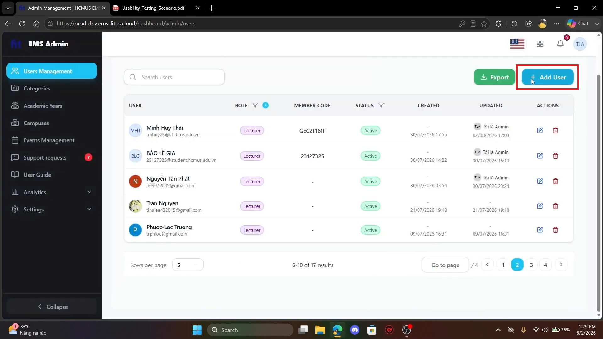 |
| BUG-C2-12 | C2 - Create User Form | Usability | Nút chuyển đổi Active/Unactive được thiết kế dạng Toggle Button nhưng độ tương phản kém và thiếu nhãn hướng dẫn, khó nhận diện thao tác. | **Task 2 - Usability** 1. Cố gắng tìm cách chuyển trạng thái Unactive cho user. 2. Quan sát Toggle Button hiện tại. | 2 (Medium) | Tăng độ tương phản màu sắc của Toggle Button và bổ sung nhãn văn bản chỉ dẫn kế bên nút. | 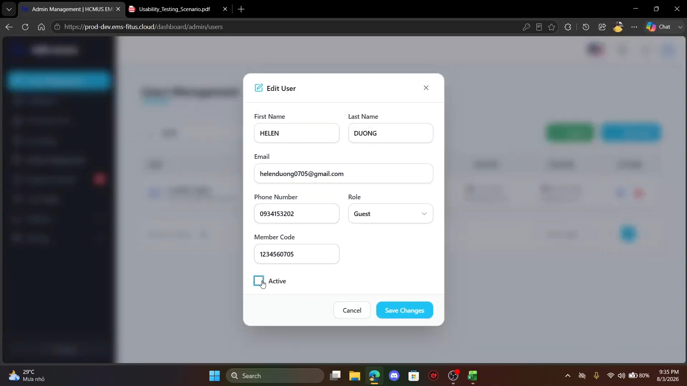 |
| BUG-C3-01 | C3 - Export to Excel | Bug | Lỗi hỏng cấu trúc tệp tin Excel xuất ra khiến Microsoft Excel thông báo lỗi và yêu cầu Repair khi mở file. | **Functional Bug 1** 1. Truy cập trang quản trị danh sách người dùng 2. Nhấn nút Export (Xuất Excel) 3. Mở file Excel đã tải xuống bằng MS Excel. | 3 (High) | Cấu hình lại thư viện kết xuất file Excel (như xlsx, exceljs) ở Backend để xuất đúng định dạng chuẩn OpenXML, tránh lỗi cấu trúc XML nội bộ gây ra cảnh báo Repair trên MS Excel. | 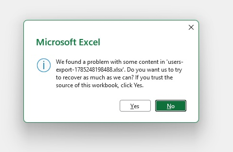 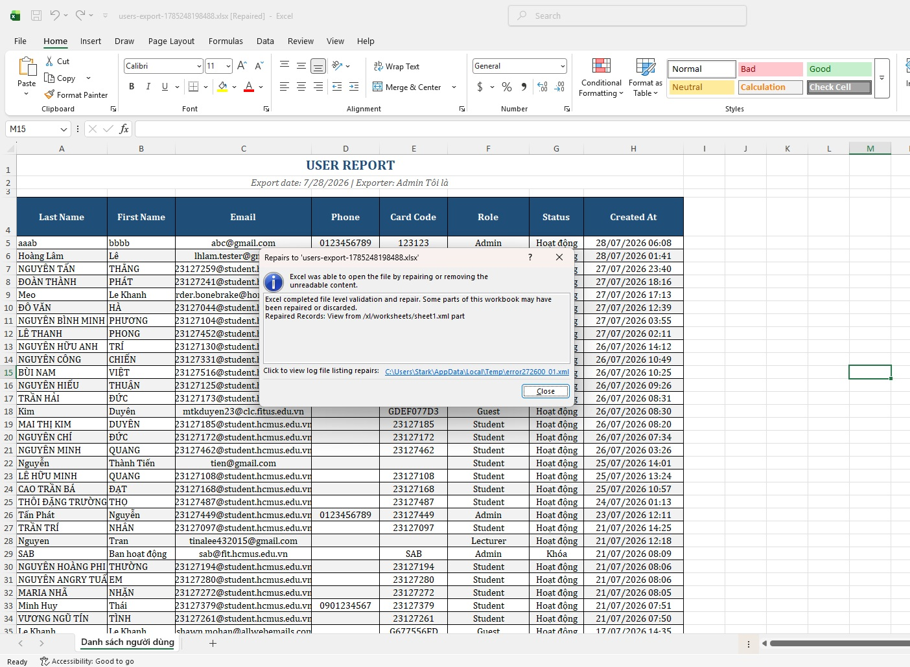 |
| BUG-C3-02 | C3 - Export to Excel | Bug | Nhãn tiêu đề cột trong file Excel xuất ra hiển thị sai từ khóa so với thiết kế (hiển thị "Card Code" thay vì "Member Code"). | **Functional Bug 2** 1. Thực hiện xuất file Excel danh sách người dùng 2. Mở file Excel lên 3. Quan sát tiêu đề cột thông tin mã thành viên. | 2 (Medium) | Cập nhật tên đề mục cột trong Backend từ "Card Code" thành "Member Code" để đồng bộ hóa thuật ngữ trên toàn hệ thống. | 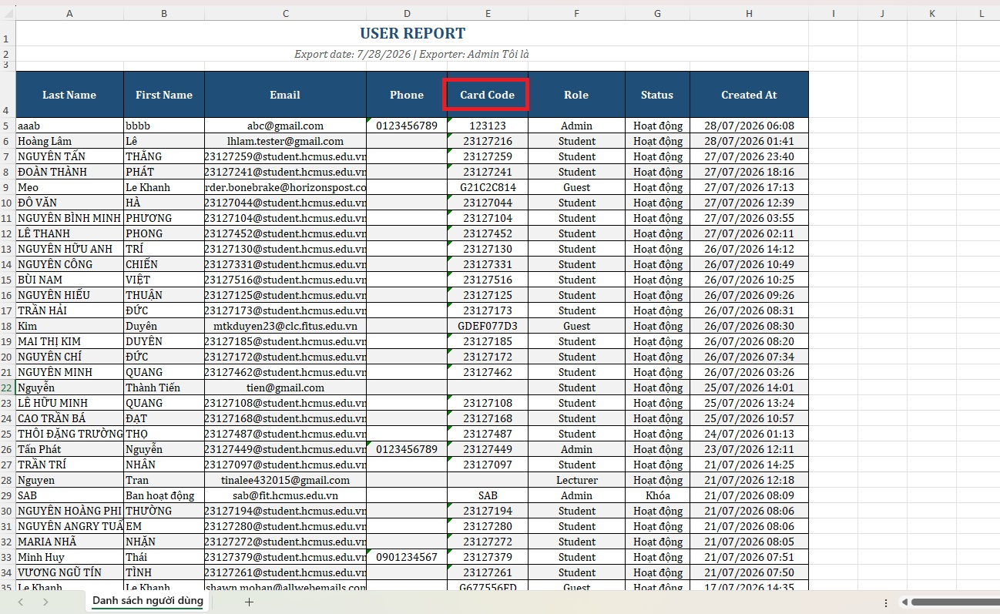 |
| BUG-C3-03 | C3 - Export to Excel | Bug | File Excel xuất ra chỉ cố định giao diện tiêu đề bằng tiếng Anh, không chuyển ngữ theo ngôn ngữ hiện tại của hệ thống. | **IA-01-04** 1. Chuyển đổi ngôn ngữ hệ thống sang tiếng Việt 2. Thực hiện nhấn nút Xuất file Excel 3. Mở file Excel kiểm tra ngôn ngữ các tiêu đề cột. | 2 (Medium) | Bổ sung cơ chế đa ngôn ngữ (i18n) khi kết xuất dữ liệu Excel, lấy ngôn ngữ hiện hành từ session/request để dịch tiêu đề cột. | 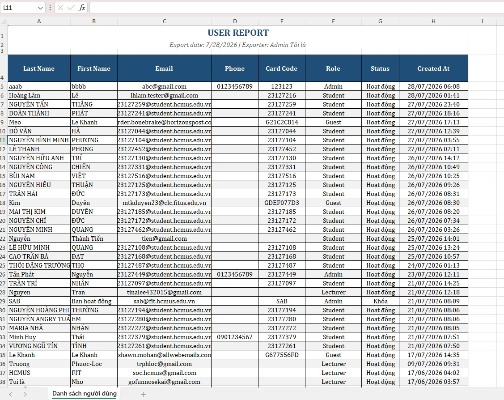 |
| BUG-C3-04 | C3 - Export to Excel | Usability | Không đồng bộ định dạng ngày tháng xuất file. Cột "Created At" dùng dd/mm/yyyy nhưng tiêu đề "Export date" dùng m/d/yyyy. | **IA-02-09** 1. Thực hiện xuất file Excel danh sách người dùng 2. Mở file và quan sát định dạng ngày tháng tại dòng "Export date" và tại cột "Created At". | 1 (Low) | Định dạng lại chuỗi hiển thị ngày tháng tại đề mục phụ "Export date" thành dd/mm/yyyy (ví dụ: 28/07/2026) để đồng bộ hóa. | 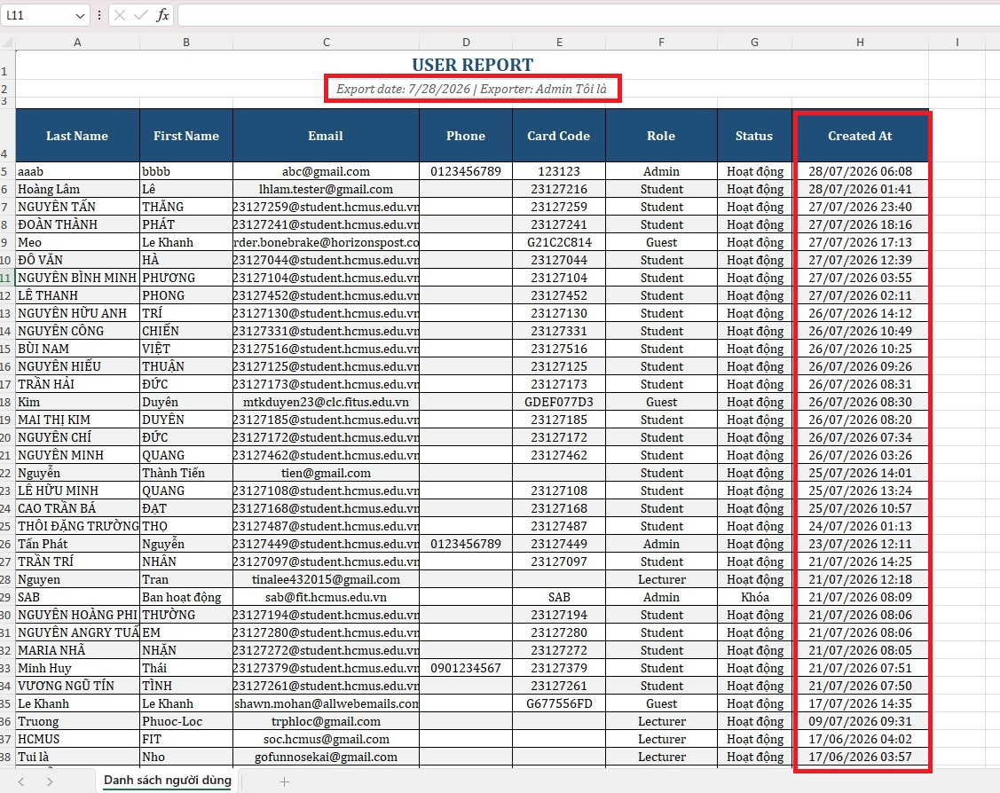 |
| BUG-C3-05 | C3 - Export to Excel | Usability | Không hiển thị Toast thông báo trạng thái tải xuống file thành công trên giao diện web. | **IA-04-01** 1. Nhấn nút Export (Xuất) 2. Chờ file tải xuống hoàn tất và quan sát giao diện web. | 1 (Low) | Thêm Toast Notification thông báo "Xuất dữ liệu người dùng thành công!" sau khi kết thúc tiến trình tải file. | 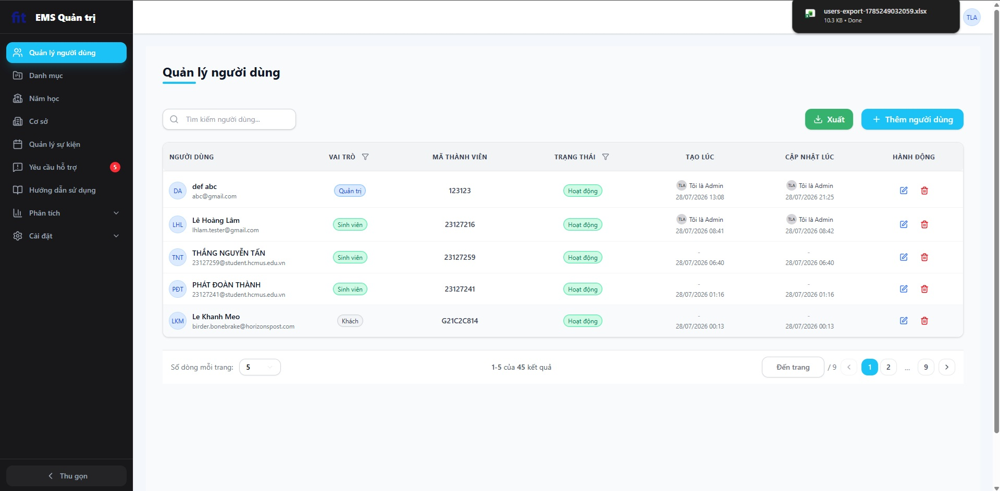 |
| BUG-C3-06 | C3 - Export to Excel | Usability | Không có thông báo hay phản hồi giao diện khi người dùng nhấn "Export" trong trạng thái mất kết nối Internet. | **IA-04-10** 1. Ngắt kết nối mạng Internet 2. Nhấn nút Export trên danh sách người dùng 3. Quan sát giao diện (không có phản hồi). | 2 (Medium) | Thiết lập xử lý ngoại tuyến, thông báo Toast lỗi rõ ràng "Không thể xuất file do mất kết nối mạng" thay vì im lặng không phản hồi. | 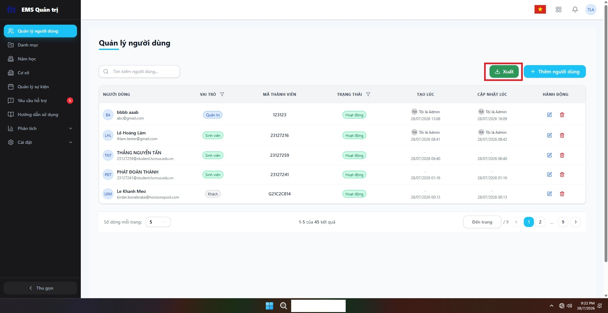 |
| BUG-C4-01 | C4 - Delete User Dialog & Audit Logs | Usability | Khi sử dụng các màn hình nhỏ (như iPhone SE) hoặc cửa sổ co hẹp, giao diện danh sách người dùng bị vỡ nát (mất cột, chồng chéo cột, rất khó bấm nút thao tác). Ngoài ra, hộp thoại xác nhận xóa (delete user dialog) hiển thị lệch ngoài tầm mắt, buộc người dùng phải tự cuộn trang thủ công để tìm hộp thoại. | **IA-01-07** 1. Sử dụng thiết bị di động (ví dụ iPhone SE) hoặc chỉnh kích thước cửa sổ devtool siêu nhỏ. 2. Vào mục quản trị danh sách user. 3. Bấm icon Thùng rác để hiển thị hộp thoại xóa. 4. Quan sát bố cục giao diện bảng danh sách và vị trí hộp thoại xóa hiển thị. | 2 (Medium) | Ẩn các cột phụ ít quan trọng khi ở màn hình mobile, hỗ trợ thanh cuộn ngang cho bảng và căn giữa Delete User Dialog cố định (fixed/absolute center) ở giữa khung hình. | 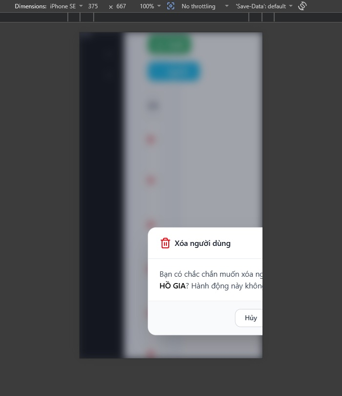 |
| BUG-C4-02 | C4 - Delete User Dialog & Audit Logs | Usability | Sau khi nhấn nút Xác nhận xóa và tài khoản biến mất khỏi bảng, hệ thống không đưa ra bất kỳ phản hồi nào (như thông báo Toast success) để xác thực thao tác xóa thành công. | **IA-04-01** 1. Bật hộp thoại xác nhận xóa người dùng. 2. Nhấn nút Xác nhận xóa. 3. Chờ tài khoản được xóa và quan sát phản hồi trên giao diện. | 2 (Medium) | Bổ sung Toast success thông báo "Xóa người dùng thành công!" sau khi lệnh API xóa phản hồi thành công. | 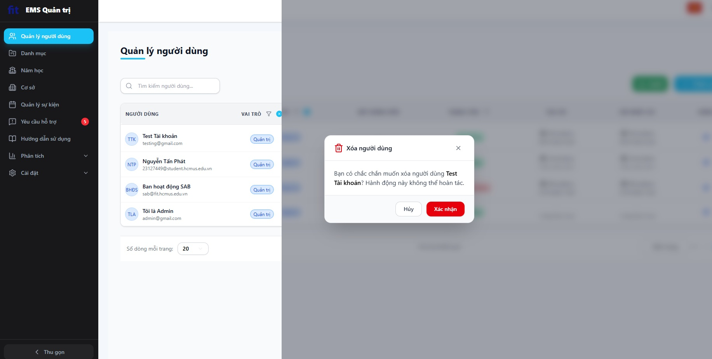 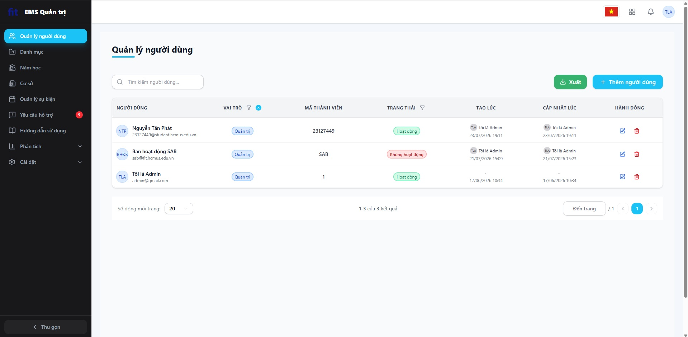 |
| BUG-C4-03 | C4 - Delete User Dialog & Audit Logs | Usability | Khi ở trạng thái ngoại tuyến (mất Internet), người dùng vẫn bấm được nút thùng rác mở dialog xóa, nhưng khi nhấn Xác nhận xóa, hệ thống im lặng hoàn toàn, không có Toast hay thông điệp báo lỗi mạng/thất bại. | **IA-04-10** 1. Ngắt kết nối mạng Internet. 2. Bấm icon Thùng rác để mở hộp thoại xóa. 3. Bấm Xác nhận xóa. 4. Quan sát phản hồi trên giao diện. | 2 (Medium) | Bắt lỗi mất mạng hoặc bắt lỗi request API thất bại và đưa ra Toast báo lỗi rõ ràng như: "Không thể kết nối internet. Vui lòng thử lại sau." | 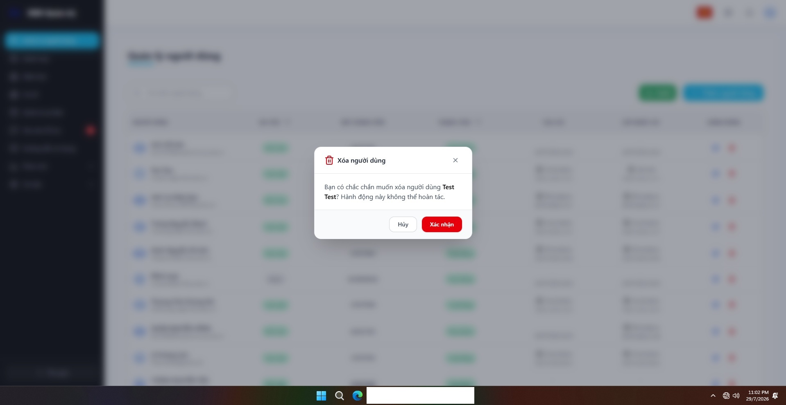 |

